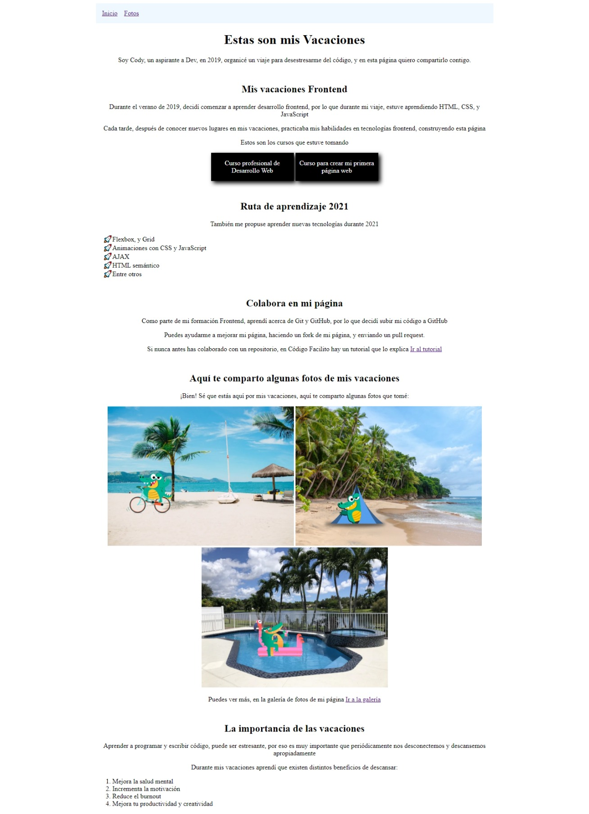
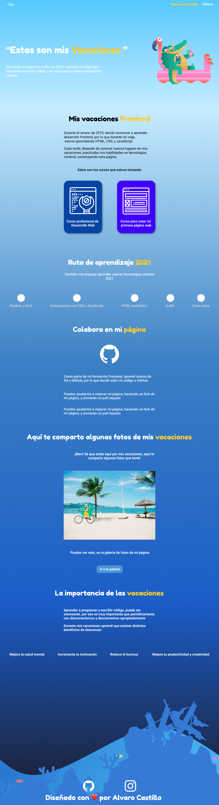
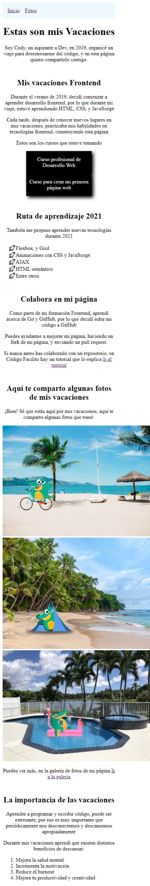
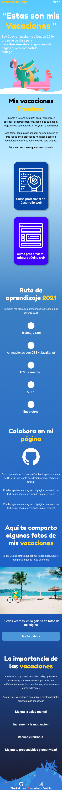

 

# Las Vacaciones de Cody

[Ver Proyecto](https://mrbanano.github.io/vacaciones-cody/)

 

**Cody**  está aprendiendo desarrollo Frontend, hizo su primer página, y ahora necesita de tu ayuda para mejorarla.

Envía un pull request rediseñando por completo la página de este repo y participa en el concurso #VeranoFrontend de Código Facilito, las personas en los 5 primeros lugares ganan:

- ✅ Un año Premium
- ✅ CSS Secrets, de Lea Verou
- ✅ Pack de stickers hasta la puerta de tu casa
- ✅ Diploma
- ✅ Asesoría personalizada para mejorar tu CV, con un reclutador de TI

Para más detalles del concurso, reglas, y consideraciones, visita: 
https://codigofacilito.com/verano/concurso

## Pasos para participar

1. Haz un fork de este repo
2. Implementa tus cambios
3. Haz un pull request con tus cambios

Es muy importante que al participar, habilites GitHub Actions y GitHub Pages en tu repositorio, así podremos ver tu página online, puedes consultar este vídeo para ver cómo participar: https://vimeo.com/577246176

## Fechas importantes
La fecha límite para enviar tu pull request es el 4 de Agosto, 11:59pm

 
 

## Solución de problemas

 

**Las vacaciones de cody** es una web estatica acerca de lo que la cody estubo haciendo en sus vaciones,sus primeros pasos en el desarollo web,los cursos que estubo tomando,las nuevas tecnologias que aprendio,conocio el control de versiones con git y github,los lugares que visito y termina contandonos lo importante que son las vacaciones para la salud mental.

Este es un proyecto que participa para el concurso de [#VeranoFrontend](https://codigofacilito.com/verano/concurso), que consiste en recibir un proyecto base y entregar una solucion mejorada con estilos personalizados, este proyecto fue diseñado con las tecnologias base:

## Desktop

### Proyecto original 
 

### Propuesta 
 

## Mobile

 

 
 

## Stats

 
 

## Lighthouse

 
 

**Mi página no se ve en GitHub Pages**
Asegúrate de haber habilitado GitHub Actions y GitHub Pages, y que la rama de GitHub Pages sea gh-pages

Diseñado con ♥️ por [Alvaro Castillo](https://www.linkedin.com/in/alvaro-castillo-c/)

