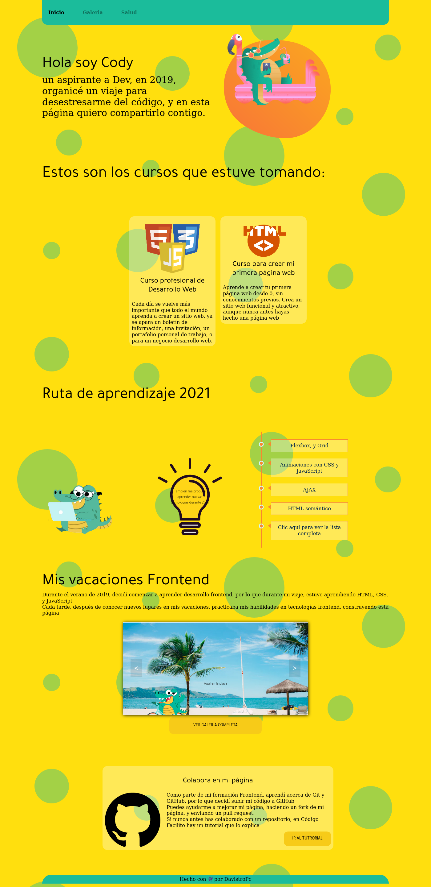
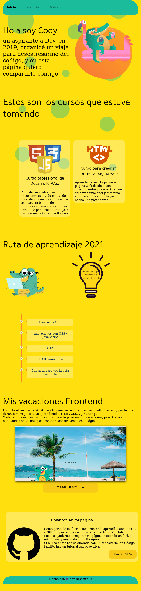
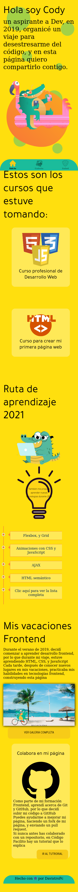

# Las Vacaciones de Cody
Para esta web, hice uso de componentes de CSS para cada sección

# Variables
``` css
    :root{
    --fontBase: 'Tajawal', sans-serif;
    --bodyText:var(--colorFont) 16px/14px var(--fontBase);
    --descriptionText: 12px/18px var(--fontBase);
    --headLine1: bold 54px/68px  'Caveat', cursive;
    --headLine2: bold 52px var(--fontBase);      
    --headLine3: bold 24px/29px var(--fontBase);
    --buttonText: bold 14px/22px  var(--fontBase);
    --bgHeader: var(--primaryColor);
    --bgColor: #ffffff;
    --bgCards: #c4c4c4;
    --colorFont: #000000;
    --priorityColor: #C05746;
    --primaryColor: #1bbc9b;
    --secondaryColor: #f7cb18;
    --tertiaryColor: #ba9912;
} 
```

# Vista Desktop


# Vista Tablet


# Vista Mobil
